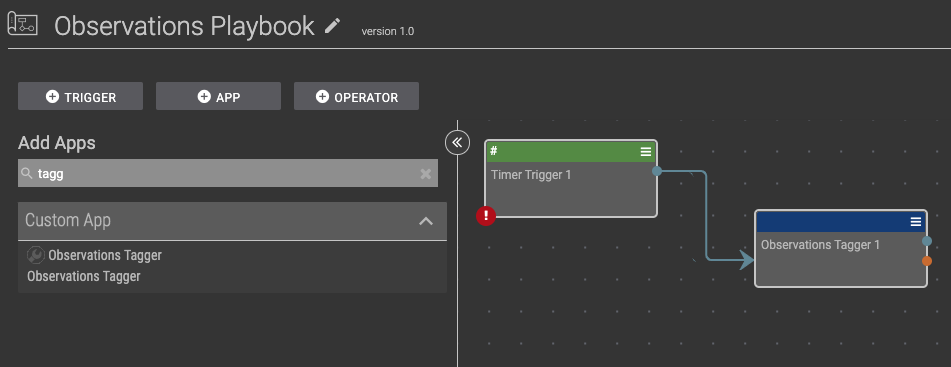
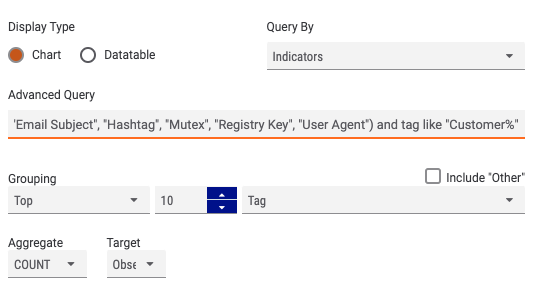
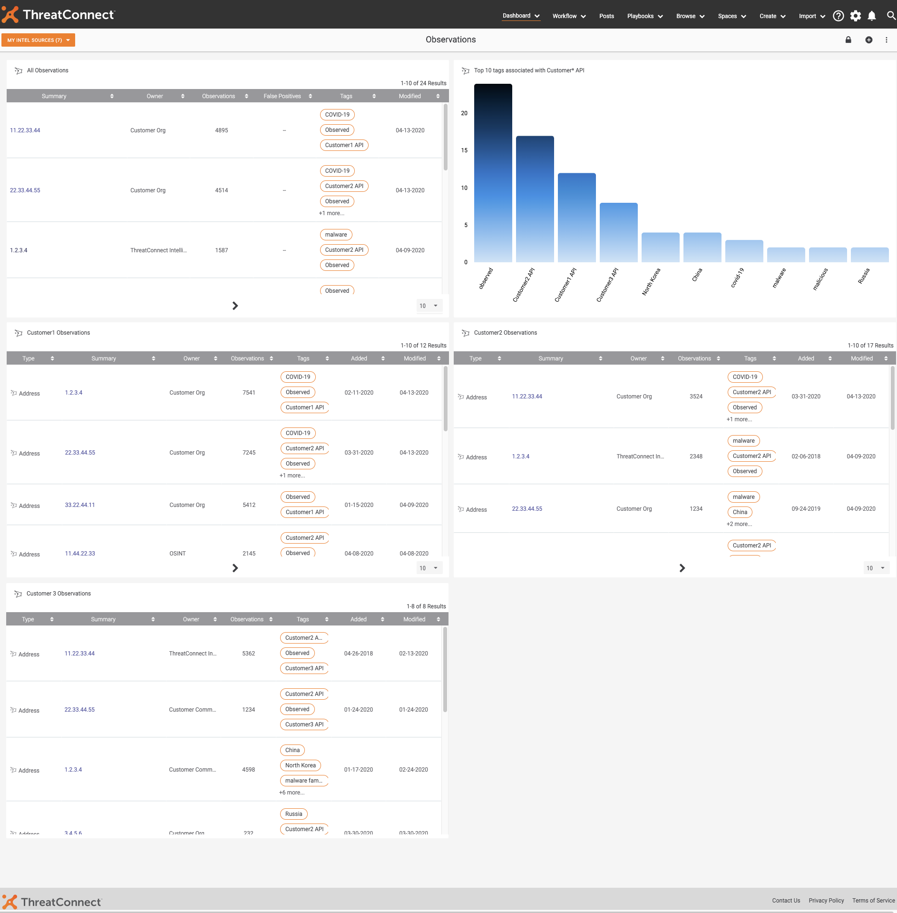

# Getting the app
## Importing the app project
Download the provided .abx file into [AppBuilder](https://training.threatconnect.com/learn/article/app-builder-kb-article#2.3).

### Build the app
[Ensure the app builds without any errors](https://training.threatconnect.com/learn/article/app-builder-kb-article#3.11)

### Release the app
[Release the app onto AppCatalog](https://training.threatconnect.com/learn/article/app-builder-kb-article#3.13)

# Creating the playbook
Create a new Playbook and add a timer trigger

## Configuring the trigger
Set the timer trigger to every 5 minutes by using the _advanced_ option and the configuration:
```0 0/5 * * * ?```


## Add the app
Add the app to the playbook and connect it the timer trigger.
 Ensuring to click the app _without_ the wrench icon.

# Configure the app
Double click the app Observations app on the canvas and add your API ID and friendly names.

For API User Mapping:
Key | Value
----|-----
API ID | Friendly name

With this mapping, for each ID that reports an observation, the indicator will be tagged with the friendly name.

The final option `Add Observation tag` if checked will also apply the tag `Observed` to any indicator returned.

# Dashboarding
## TQL

### Create a new dashboad
[Create a new dashboard to add your cards to](https://training.threatconnect.com/learn/article/dashboard-kb-article#2.1)

## Add cards
[Add a new Query Card](https://training.threatconnect.com/learn/article/dashboard-kb-article#2.2.3) Using the TQL:
``` typeName in ("Address", "EmailAddress", "File", "Host", "URL", "ASN", "CIDR", "Mutex", "Registry Key", "User Agent") and tag like "Observed" ```
Will return all observations.


For my example as I am using predictable names, using the TQL filters of:

```typeName in ("Address", "EmailAddress", "File", "Host", "URL", "ASN", "CIDR", "Mutex", "Registry Key", "User Agent") and tag like "Customer1%"```

```typeName in ("Address", "EmailAddress", "File", "Host", "URL", "ASN", "CIDR", "Mutex", "Registry Key", "User Agent") and tag like "Customer2%"```

```typeName in ("Address", "EmailAddress", "File", "Host", "URL", "ASN", "CIDR", "Mutex", "Registry Key", "User Agent") and tag like "Customer3%"```

I'm able to generate seperate dashboard cards that allow me to see where any overlap with as well as my most recent observations.

Using the TQL of:

```typeName in ("Address", "EmailAddress", "File", "Host", "URL", "ASN", "CIDR", "Email Subject", "Hashtag", "Mutex", "Registry Key", "User Agent") and tag like "Customer% API"```

and changing the Grouping from _indicator_ to _tag_ will return top 10 tags that also used along with my CustomerX tags.




